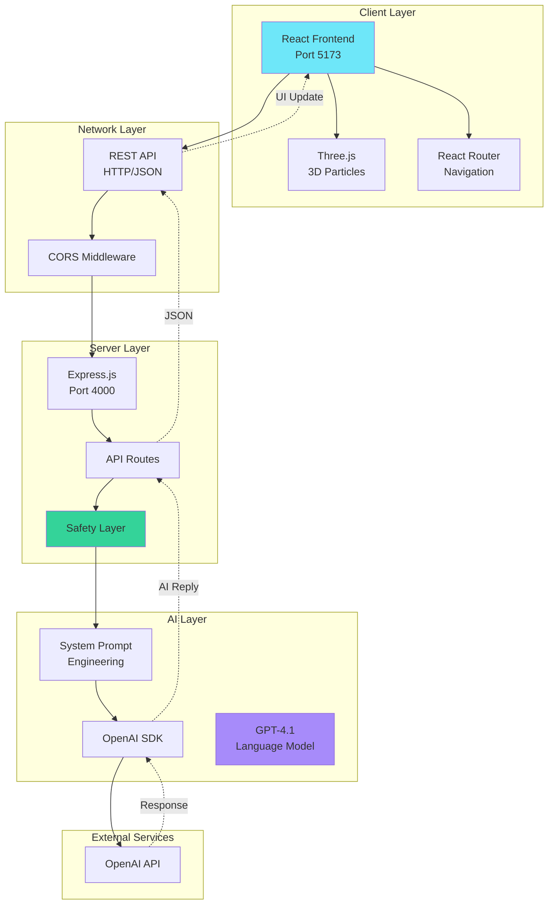
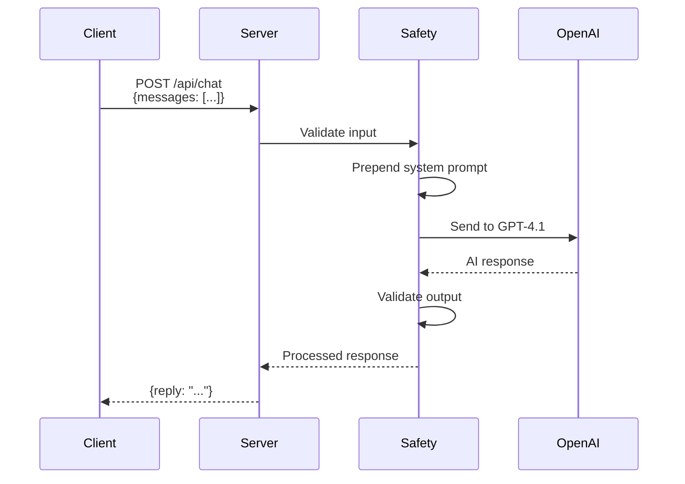
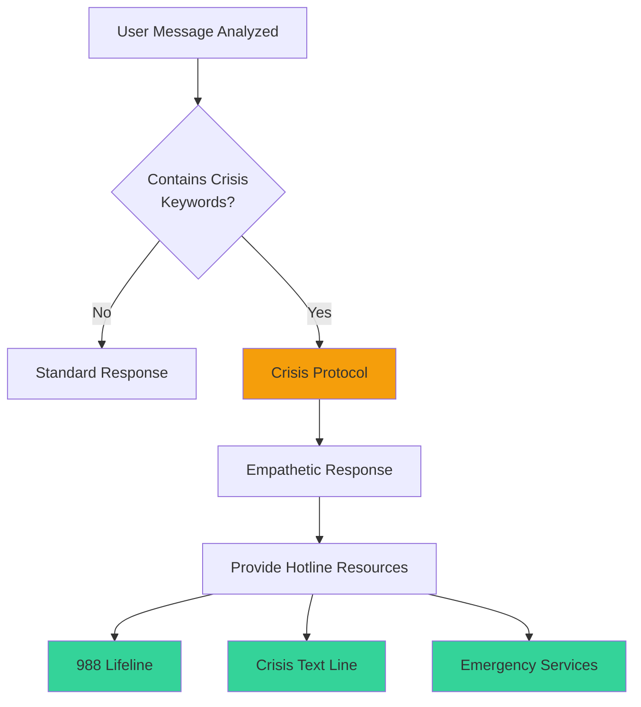
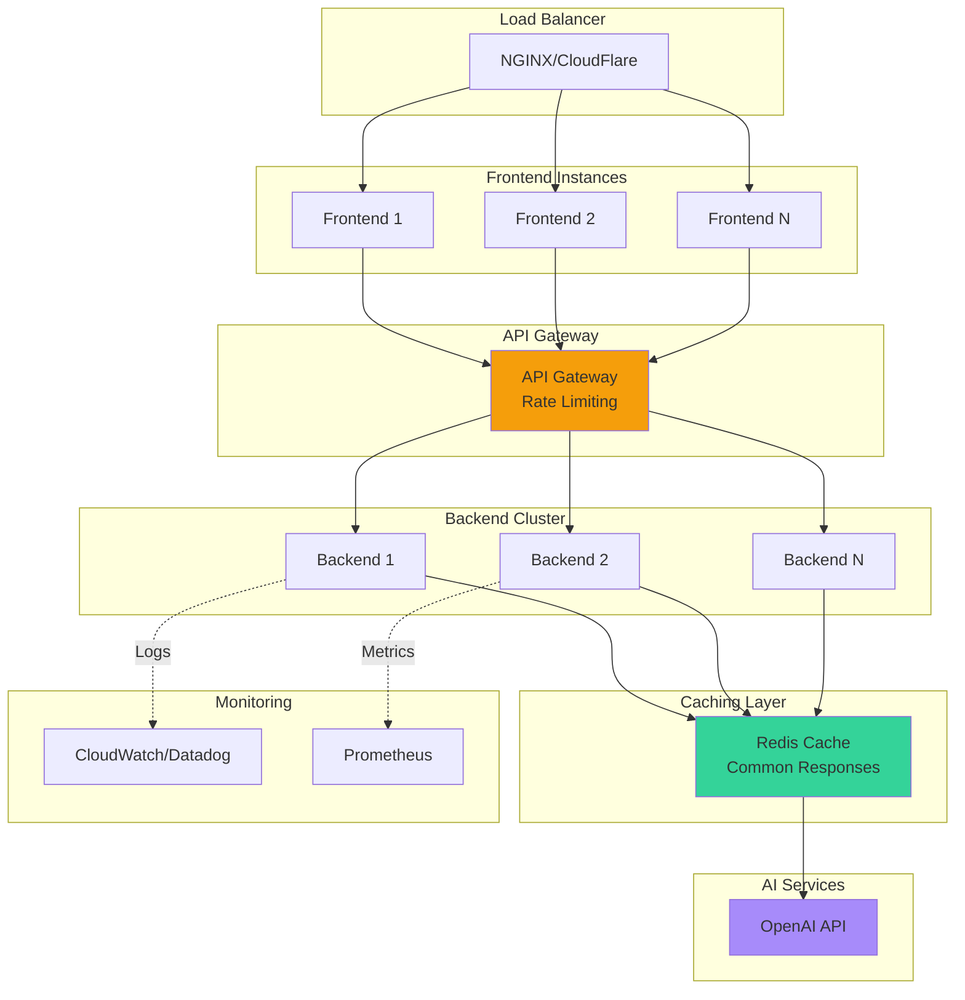

# Serenity - System Architecture Documentation

> **AI Hackathon Submission**  
> Mental Wellness AI Companion

---

## Table of Contents

1. [High-Level Architecture](#high-level-architecture)
2. [Component Breakdown](#component-breakdown)
3. [Data Flow](#data-flow)
4. [Technology Stack](#technology-stack)
5. [AI Integration Layer](#ai-integration-layer)
6. [Security Architecture](#security-architecture)
7. [Scalability Considerations](#scalability-considerations)

---

## High-Level Architecture

Serenity follows a **client-server architecture** with AI integration, designed for modularity, maintainability, and scalability.



---

## Component Breakdown

### Frontend Components

#### 1. **React Application** (`mental-wellness-bot/`)

**Responsibility**: User interface, user experience, client-side logic

**Key Components**:
- **Pages**:
  - `Onboarding.jsx` - Landing page with consent flow
  - `Chat.jsx` - Main conversational interface
  - `Info.jsx` - Information and resources
  
- **UI Components**:
  - `MessageList.jsx` - Message rendering with animations
  - `MessageInput.jsx` - Auto-resizing input field
  - `CrisisBanner.jsx` - Emergency resources modal
  - `MouseTracker.jsx` - Custom cursor and gradient
  - `ThreeBackground.jsx` - 3D particle system

**Technology**: React 19.2.0, Vite 7.3.1, React Router DOM 7.13.0

**Build Output**: Static files in `dist/` directory

---

#### 2. **Visual Effects System**

**Responsibility**: Premium UI/UX with 3D effects

**Components**:
- **Three.js Integration**: 1000 animated particles with color gradients
- **Custom Cursor**: Glowing cursor with mouse tracking
- **Glassmorphism**: Frosted glass effects with backdrop blur
- **Gradient Overlay**: Radial gradient following mouse position

**Performance**: Hardware-accelerated transforms, optimized particle rendering

---

### Backend Components

#### 3. **Express.js Server** (`server/`)

**Responsibility**: API orchestration, business logic, AI integration

**Key Modules**:
```javascript
server/
├── index.js          // Main server file
├── package.json      // Dependencies
└── .env             // Environment variables
```

**Endpoints**:
- `POST /api/chat` - AI conversation endpoint
- `GET /api/health` - Health check endpoint

**Middleware Stack**:
1. CORS - Cross-origin resource sharing
2. JSON Parser - Request body parsing
3. Error Handler - Centralized error handling

---

#### 4. **AI Integration Layer**

**Responsibility**: OpenAI API communication, prompt engineering, safety

**Flow**:


**System Prompt Features**:
- Role definition (empathetic companion)
- Safety constraints (no medical advice)
- Crisis detection triggers
- Response formatting guidelines

---

## Data Flow

### Chat Message Flow

```mermaid
flowchart LR
    A[User Types Message] --> B[MessageInput Component]
    B --> C[Chat.jsx State Update]
    C --> D[Display User Message]
    C --> E[API Call: POST /api/chat]
    E --> F[Express Server Receives]
    F --> G[System Prompt Prepended]
    G --> H[OpenAI API Call]
    H --> I[GPT-4.1 Processing]
    I --> J[AI Response Generated]
    J --> K[Safety Validation]
    K --> L[Return to Frontend]
    L --> M[Display Bot Message]
    M --> N[Auto-scroll to Bottom]
    
    style A fill:#6ee7f9
    style I fill:#a78bfa
    style M fill:#34d399
```



### Crisis Detection Flow



---

## Technology Stack

### Frontend Stack

| Technology | Version | Purpose |
|------------|---------|---------|
| React | 19.2.0 | UI framework |
| Vite | 7.3.1 | Build tool & dev server |
| React Router DOM | 7.13.0 | Client-side routing |
| Three.js | r128 | 3D graphics |
| CSS Variables | N/A | Design system |
| Google Fonts (Inter) | N/A | Typography |

**Why React?**
- Component reusability
- Virtual DOM for performance
- Large ecosystem
- Excellent developer experience

**Why Vite?**
- Lightning-fast HMR (Hot Module Replacement)
- Optimized production builds
- Native ES modules support

**Why Three.js?**
- Industry-standard 3D library
- WebGL rendering
- Rich particle system capabilities

---

### Backend Stack

| Technology | Version | Purpose |
|------------|---------|---------|
| Node.js | 16+ | JavaScript runtime |
| Express.js | 5.2.1 | Web framework |
| OpenAI SDK | 6.21.0 | AI integration |
| CORS | 2.8.6 | Cross-origin requests |
| dotenv | 17.2.4 | Environment variables |

**Why Express.js?**
- Minimal, flexible framework
- Robust middleware ecosystem
- RESTful API support
- Wide adoption and community

**Why OpenAI GPT-4.1?**
- State-of-the-art language understanding
- Nuanced emotional intelligence
- Safety features built-in
- Reliable API with good documentation

---

## AI Integration Layer

### Model Selection: GPT-4.1

**Rationale**:
1. **Emotional Intelligence**: Superior at understanding nuanced emotions
2. **Safety**: Better at following complex safety guidelines
3. **Reliability**: Consistent, high-quality responses
4. **Context Understanding**: Excellent multi-turn conversation handling

### System Prompt Architecture

```
┌─────────────────────────────────────┐
│      SYSTEM PROMPT STRUCTURE        │
├─────────────────────────────────────┤
│                                     │
│  1. Role Definition                 │
│     - Identity (Serenity)           │
│     - Tone (warm, empathetic)       │
│     - Format (2-4 paragraphs)       │
│                                     │
│  2. Core Capabilities               │
│     - Active listening              │
│     - Emotional validation          │
│     - Gentle guidance               │
│                                     │
│  3. Safety Constraints              │
│     - NOT a therapist               │
│     - Cannot diagnose/treat         │
│     - No medical advice             │
│                                     │
│  4. Crisis Protocols                │
│     - Detect self-harm mentions     │
│     - Provide immediate resources   │
│     - Encourage professional help   │
│                                     │
└─────────────────────────────────────┘
```

### Conversation Context Management

```javascript
// Frontend sends full conversation history
const conversationHistory = messages
  .filter(m => m.id !== 'welcome')
  .map(m => ({
    role: m.sender === 'user' ? 'user' : 'assistant',
    content: m.text
  }));

// Backend prepends system prompt
const fullContext = [
  { role: 'system', content: SYSTEM_PROMPT },
  ...conversationHistory
];
```

**Benefits**:
- Maintains conversation coherence
- AI remembers user context
- Personalized responses
- Natural dialogue flow

---

## Security Architecture

### API Key Management

```
┌──────────────────────────────────────┐
│   Environment Variables (.env)       │
├──────────────────────────────────────┤
│  OPENAI_API_KEY=sk-...               │
│  PORT=4000                           │
└──────────────────────────────────────┘
         │
         ▼
┌──────────────────────────────────────┐
│   Server Startup (index.js)          │
├──────────────────────────────────────┤
│  - Validates API key exists          │
│  - Warns if placeholder detected     │
│  - Never logs key value              │
└──────────────────────────────────────┘
```

### CORS Configuration

```javascript
// Development: Allow all origins
app.use(cors());

// Production: Restrict to frontend domain
app.use(cors({
  origin: 'https://your-frontend.com'
}));
```

### Input Validation

- **Server-side**: Validates `messages` array exists
- **Client-side**: Trims whitespace, rejects empty messages
- **Type checking**: Ensures proper message structure

### Data Privacy

- **No Database**: Messages not persisted after session
- **No Logging**: User messages not logged to console
- **No Tracking**: No analytics or monitoring of conversations
- **Session-only**: Conversation exists only in browser memory

---

## Scalability Considerations

### Current Architecture (MVP)

```
Single Frontend Instance ──▶ Single Backend Instance ──▶ OpenAI API
```

**Limitations**:
- Single point of failure
- Limited concurrent users (~50-100)
- Cost scales linearly with users

---

### Future Scalability Path



### Optimization Strategies

#### 1. **Frontend Optimization**
- CDN for static assets
- Code splitting by route
- Lazy loading components
- Asset compression (gzip/brotli)

#### 2. **Backend Optimization**
- Connection pooling
- Response caching (Redis)
- Rate limiting per user
- Request queuing

#### 3. **AI Cost Optimization**
- Cache common greetings/responses
- Implement token limits per request
- Use streaming responses for better UX
- Monitor usage patterns

#### 4. **Infrastructure**
- Horizontal scaling (multiple backend instances)
- Auto-scaling based on load
- Regional deployments for latency
- Database for conversation history (optional)

---

## Deployment Architecture

### Development

```
┌─────────────────────┐    ┌─────────────────────┐
│  Frontend Dev       │    │  Backend Dev        │
│  localhost:5173     │◀──▶│  localhost:4000     │
│  (Vite HMR)        │    │  (Nodemon)          │
└─────────────────────┘    └─────────────────────┘
```

### Production

```
┌─────────────────────────────────────────────────┐
│           CDN (CloudFlare/Vercel)               │
│  - Static assets                                │
│  - Frontend (React build)                       │
└────────────────┬────────────────────────────────┘
                 │
                 ▼
┌─────────────────────────────────────────────────┐
│       Backend (Render/Railway/Heroku)           │
│  - Express.js API                               │
│  - OpenAI integration                           │
│  - Environment variables                        │
└────────────────┬────────────────────────────────┘
                 │
                 ▼
┌─────────────────────────────────────────────────┐
│           OpenAI API (External)                 │
│  - GPT-4.1 inference                            │
└─────────────────────────────────────────────────┘
```

**Recommended Platforms**:
- **Frontend**: Vercel (zero-config, automatic deployments)
- **Backend**: Render (free tier, easy setup, automatic HTTPS)

---

## Error Handling & Resilience

### Frontend Error Handling

```javascript
try {
  const response = await fetch(API_URL, {...});
  if (!response.ok) throw new Error('API Error');
  const data = await response.json();
  // Handle success
} catch (error) {
  console.error('Chat error:', error);
  // Display friendly error message
  // Suggest using crisis button
}
```

### Backend Error Handling

```javascript
app.post('/api/chat', async (req, res) => {
  try {
    // Validate input
    if (!req.body.messages) {
      return res.status(400).json({ error: 'Invalid request' });
    }
    
    // Call OpenAI
    const response = await openai.responses.create({...});
    res.json({ reply: response.output_text });
    
  } catch (error) {
    console.error('OpenAI error:', error);
    res.status(500).json({ 
      error: 'AI service temporarily unavailable' 
    });
  }
});
```

### Graceful Degradation

- **API Failure**: Show friendly error, suggest crisis button
- **Network Issues**: Display offline message
- **Rate Limits**: Queue requests or show "busy" state

---

## Monitoring & Health Checks

### Health Check Endpoint

```javascript
app.get('/api/health', (req, res) => {
  res.json({
    status: 'ok',
    timestamp: new Date().toISOString(),
    uptime: process.uptime()
  });
});
```

### Recommended Monitoring

1. **Uptime Monitoring**: Ping health endpoint every 5 minutes
2. **Error Tracking**: Sentry or similar service
3. **Performance Metrics**: Response times, API latency
4. **Cost Monitoring**: OpenAI token usage alerts

---

## Conclusion

Serenity's architecture prioritizes:
- ✅ **Modularity**: Clean separation of concerns
- ✅ **Maintainability**: Well-organized, documented code
- ✅ **Safety**: Multiple layers of safety checks
- ✅ **Scalability**: Clear path to production scale
- ✅ **User Experience**: Premium UI with 3D effects
- ✅ **Privacy**: No data persistence, session-only

The system demonstrates **production-grade engineering** with thoughtful design decisions aligned with mental wellness use case requirements.
